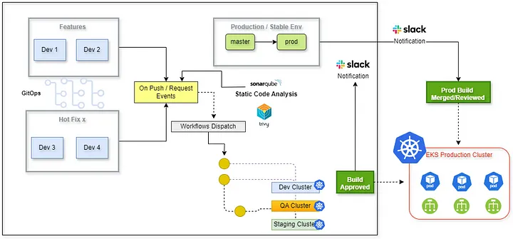

# The Guide to Terraform DevOps: Implementing CI/CD Pipelines for EKS workloads with GitHub Actions for Multi-Environments Approach



This technical handbook offers a comprehensive guide on implementing CI/CD Pipelines for EKS workloads using GitHub Actions for Multi-Environments, alongside Terraform for provisioning and HashiCorp Vault for securing secrets, SonarCloud for code quality analysis, and Trivy for vulnerability scanning. GitHub Actions will manage the conventional DevOps workflows, establishing multiple predefined environments for the deployment pipeline, such as DEV, Staging, UAT, Pre-prod, and production. Throughout this article, we’ll illustrate our approach using a React-based e-commerce application as a case study.

- [@Joel O. Wembo](https://www.joelotepawembo.com)
- [@twitter](twitter.com/joelwembo1)
- [@linkedin](https://www.linkedin.com/in/joelotepawembo)


### Prerequisites:
Before we get into the good stuff, first we need to make sure we have the required services on our local machine or dev server, which are:

- AWS Account
- GitHub Account
- AWS CLI installed and configured.
- Docker installed locally.
- NPM
- NodeJS
- Terraform
- Basic Understanding of Jenkins
- A Domain name Hosted by any domain name provider ( Ex: AWS Route 53 )
- Basic familiarity with YAML and GitHub workflows.
- A React Project hosted in a GitHub repository
- Basic knowledge of HTML or React
- Any Browser for testing

# Requirements

- [x] #1 Create AWS Access Keys
- [x] Set Up Custom Domain
- [x] Create your React / Front-End Application :tada:
- [x] #2 Provision an AWS EC2 instance with Ansible
- [x] Jenkins Installation
- [x] Setting up a CI/CD pipeline using Terraform :tada:
- [x] Terraform Cloud Configuration
- [x] Check result in your AWS Management Console :tada:

@octocat :+1: This project looks great - Let’s Get It Started! :shipit:

## local testing

In the project directory, you can run:

### `npm start`

Runs the app in the development mode.\
Open [http://localhost:3000](http://localhost:3000) to view it in your browser.

The page will reload when you make changes.\
You may also see any lint errors in the console.

## docker && docker compose

 ```
DOCKER_SCAN_SUGGEST=false docker build -t prodxcloud-store:latest .
 ```
  ```
docker run -p 80:80 --name react prodxcloud-store:latest
 ```

## You can install aws cli using the following command


```
curl "https://awscli.amazonaws.com/awscli-exe-linux-x86_64.zip" -o "awscliv2.zip"

unzip awscliv2.zip

sudo ./aws/install

```

Next, configure your aws account in your computer using the following command:

```
aws configure
```

### Create a Production Build of your application

```
npm run build
```
### `#Generate SSH keys`


```
# 1. This creates a public (.pub) and private key in the ~/.ssh/ directory
ssh-keygen -t rsa -b 4096 -f ~/.ssh/myKey
Generating public/private rsa key pair.
Enter passphrase (empty for no passphrase):  # Can be left blank

# 2. Ensure private key is not publicly viewable
chmod 400 ~/.ssh/mykey
```

> [!NOTE]
> This project contains multiple types of deployments.


## Ansible Doc

[Ansible Doc](deployments/docs/Ansible-EC2-React.png)

```

```

## Github Actions 


```
# Github Workflows Terraform Pipeline Provision To Deploy to AWS EKS 
name: PRODUCTION --> Terraform CI/CD pipeline To AWS EKS Cluster - Enterprise


concurrency:
  group: production
  cancel-in-progress: true

on:
    push:
      branches: [master, production/*]
    pull_request:
      types: [review_requested]
      branches: [master, production/*]

    workflow_dispatch:
      inputs:
        git-ref:
          description: Git Ref (Optional)
          default: master
          required: false
    
        account:
          description:  production
          default: production
          required: true  

        account_prod:
          description: production
          default: production
          required: true
     
        environment:
          description: production (final, latest)
          default: production
          required: false  

env:


 TF_LOG: INFO
 APP_NAME: prodxcloud-store
 AWS_ACCESS_KEY_ID: ${{ secrets.AWS_ACCESS_KEY_ID }}
 AWS_SECRET_ACCESS_KEY: ${{ secrets.AWS_SECRET_ACCESS_KEY }}
 DOCKER_USERNAME: ${{ secrets.DOCKERHUB_USERNAME }}
 DOCKER_PASSWORD: ${{ secrets.DOCKERHUB_TOKEN }}
 KUBE_CONFIG_DATA: ${{ secrets.KUBE_CONFIG_DATA }}
 AWS_DEFAULT_REGION: "us-east-1"  
 CONFIG_DIRECTORY: "./deployment/terraform/terraform-provision-ekscluster-use-case-1"


jobs:
  CodeScan-SonarCloud:
    name: SonarCloud Scaning
    runs-on: ubuntu-latest
    steps:
      - uses: actions/checkout@v3
        with:
             fetch-depth: 0
      - name: Code Scaning process 
        run: pwd  
  build:
    name: build
    runs-on: ubuntu-latest
    needs: [CodeScan-SonarCloud]
    strategy:
      matrix:
        node-version: [18]
    steps:
      - uses: actions/checkout@v3
      # caching mechanisme
      - name: Cache dependencies
        uses: actions/cache@v2
        with:
          path: |
            **/node_modules
          key: ${{ runner.os }}-${{ hashFiles('**/package-lock.json') }}
      
      - name: Use Node.js ${{ matrix.node-version }}
        uses: actions/setup-node@v3
        with:
          node-version: ${{ matrix.node-version }}
          cache: 'npm'
      # npm install all packages  
      - name: Install dependencies  
        run: npm install --legacy-peer-deps
        # run: npm version
      
      - name: Build reactjs application
        run: npm run build --if-present
      
      - name: list all packages & dependencies
        run: npm list
      # Dockerhub Build and Push
      - name: Build docker docker image for production
        uses: docker/login-action@v2
        with:
          username: ${{ env.DOCKER_USERNAME }}
          password: ${{ env.DOCKER_PASSWORD }}
      - run: docker build -t joelwembo/prodxcloud-store:prod .
      - run: docker push joelwembo/prodxcloud-store:prod
      - run: docker version

  trivyScanDockerImage:
        name: trivy scan - security scanner
        runs-on: ubuntu-latest
        if: ${{ always() }}
        needs: [CodeScan-SonarCloud, build]
        steps:
          - name: Checkout code
            uses: actions/checkout@v2
          - name: Build an image from Dockerfile
            run: |
              docker version
              # docker build -t docker.io/joelwembo/prodxcloud-store:prod .
          - name: Run Trivy vulnerability scanner
            uses: aquasecurity/trivy-action@master
            with:
              image-ref: 'docker.io/joelwembo/prodxcloud-store:prod'
              format: 'table'
            #   exit-code: '1'
              ignore-unfixed: true
              vuln-type: 'os,library'
              severity: 'CRITICAL,HIGH'  
          - name: Push Docker Image for production  
            run: docker push joelwembo/prodxcloud-store:prod   

  qa:
    name: QA Deploy to Staging
    environment:
      name: staging
      url: https://staging.production.net/
    runs-on: ubuntu-latest
    needs: [build, trivyScanDockerImage]
    steps:
      - name: Running Tests
        uses: actions/checkout@v3
      - run: echo "running Tests"
      # - run: npm test
  
  deploy:
    name: Deploy to EKS
    environment: 
      name: production
      url: https://production.prodxcloud.net/
    runs-on: ubuntu-latest
    needs: qa
    strategy:
      matrix:
        environment: [production]
    steps:
      - name: Checkout repository
        uses: actions/checkout@v2

      - name: Terraform Setup and Apply
        id: terraform_apply
        uses: hashicorp/setup-terraform@v3
        with:
          terraform_version: 1.1.7
          # cli_config_credentials_hostname: 'terraform.example.com'
          # cli_config_credentials_token: ${{ env.TF_API_TOKEN }}
      - name: Terraform Init
        run: terraform init
        working-directory: ./deployment/terraform/terraform-provision-ekscluster-use-case-1

      - name: Terraform Plan
        id: terraform_plan
        run: terraform plan -out=tfplan -var="environment=${{ matrix.environment }}"
        working-directory: ./deployment/terraform/terraform-provision-ekscluster-use-case-1

      - name: Terraform Apply
        if: matrix.environment == 'qa' || matrix.environment == 'production'
        run: terraform apply -auto-approve -input=false -lock=false
        working-directory: ./deployment/terraform/terraform-provision-ekscluster-use-case-1

      - name: Kubernetes Setup
        uses: azure/k8s-set-context@v1
        with:
          kubeconfig: ${{ env.KUBE_CONFIG_DATA }}

      - name: Update kubeconfig
        run: aws eks --region us-east-1 update-kubeconfig --name prodxcloud-cluster
        env:
          AWS_ACCESS_KEY_ID: ${{ env.AWS_ACCESS_KEY_ID }}
          AWS_SECRET_ACCESS_KEY: ${{ env.AWS_SECRET_ACCESS_KEY }}
          AWS_DEFAULT_REGION: ${{ env.AWS_DEFAULT_REGION}}  

      - name: Get Kubernetes Pods
        run: kubectl get pods --namespace default

      - name: Get Kubernetes Nodes
        run: kubectl get nodes

      - name: Get Kubernetes Services
        run: kubectl get services --namespace default

      - name: Get Load Balancer DNS
        run: kubectl get services prodxcloud-store

    outputs:
      APP_NAME: prodxcloud-store
      AWS_ACCESS_KEY_ID: ${{ env.AWS_ACCESS_KEY_ID }}
      AWS_SECRET_ACCESS_KEY: ${{ env.AWS_SECRET_ACCESS_KEY }}
      DOCKER_USERNAME: ${{ env.DOCKERHUB_USERNAME }}
      DOCKER_PASSWORD: ${{ env.DOCKERHUB_TOKEN }}
      KUBE_CONFIG_DATA: ${{ env.KUBE_CONFIG_DATA }}
      AWS_DEFAULT_REGION: ${{ env.AWS_DEFAULT_REGION }}

      # - name: Kubernetes Deployment
      #   run: kubectl apply -f k8s/deployment.yaml

```

### Useful Operations / Commands

```


kubectl get svc

kubectl apply -f k8s/aws-test.yaml

kubectl exec aws-cli -- aws s3api list-buckets
kubectl get pods

kubectl apply -f k8s/deployment.yaml 

kubectl apply -f k8s/public-lb.yaml
kubectl apply -f k8s/private-lb.yaml 

kubectl get pods
kubectl get services
```
```

kubectl apply -f k8s/cluster-autoscaler.yaml
kubectl get pods -n kube-system
```

```

kubectl expose deployment prodxcloud-store --type=LoadBalancer --port=80  --target-port=80 -n prodxcloud-store --name=prodxcloud-store

Expose the application without namespace because we are the default namespace
kubectl expose deployment prodxcloud-store --type=LoadBalancer --port=80  --target-port=80 --name=prodxcloud-store
kubectl get services prodxcloud-store
kubectl get svc
```


## EKS multi-cluster and multi-environment deployment

- commit : added new feature for multi stage deployment
- commit : add new environment before production

Thank you for Reading !! 🙌🏻, see you in the next article.🤘

# For more information about the author visit

- [@Joel O. Wembo](https://www.joelotepawembo.com)
- [@twitter](twitter.com/joelwembo1)
- [@linkedin](https://www.linkedin.com/in/joelotepawembo)


